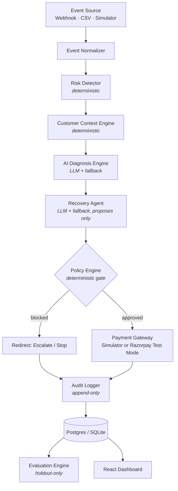

# RazorRecover AI

**AI Revenue Recovery — Razorpay AI Buildathon 2026**

An end-to-end system that detects revenue at risk from failed/at-risk
payments, diagnoses the likely cause, proposes a bounded recovery action,
gates it through a deterministic safety policy, executes it, and measures
what actually got recovered — with a complete, immutable audit trail behind
every decision.

> **Nothing here uses real money or real customer data, under any
> configuration.** See [§ What's real vs. simulated](#whats-real-vs-simulated).

---

## Table of contents

1. [What is RazorRecover AI?](#1-what-is-razorrecover-ai)
2. [Problem](#2-problem)
3. [Why this matters](#3-why-this-matters)
4. [Demo](#4-demo)
5. [Architecture](#5-architecture)
6. [AI architecture](#6-ai-architecture)
7. [Recovery workflow](#7-recovery-workflow)
8. [Safety boundaries](#8-safety-boundaries)
9. [Dataset](#9-dataset)
10. [Evaluation methodology](#10-evaluation-methodology)
11. [Results](#11-results)
12. [Failure handling](#12-failure-handling)
13. [Screenshots](#13-screenshots)
14. [Local setup](#14-local-setup)
15. [Environment variables](#15-environment-variables)
16. [API documentation](#16-api-documentation)
17. [Design decisions](#17-design-decisions)
18. [Limitations](#18-limitations)
19. [Future improvements](#19-future-improvements)

---

## 1. What is RazorRecover AI?

A merchant's payments fail for all kinds of reasons — a temporary network
blip, insufficient funds, a declined card, an abandoned checkout, an overdue
invoice. Some of that revenue is genuinely recoverable with the right,
low-friction nudge. Most systems either do nothing (leaving money on the
table) or retry blindly (annoying customers and burning processing fees on
cases that were never going to succeed).

RazorRecover AI runs every at-risk payment through a five-stage pipeline —
**risk detection → AI diagnosis → bounded action proposal → policy gate →
execution** — and logs every step so a human can see exactly why the system
did what it did. Batch-processes hundreds to thousands of events, then
reports honest, held-out-evaluated metrics on how well it actually worked.

## 2. Problem

Payment failure is treated as a dead end by most integrations: the payment
failed, the transaction is logged, and recovery (if it happens at all) is
manual, ad hoc, and undocumented. There's no systematic way to know: how much
revenue is genuinely at risk right now, which of it is worth pursuing, what
the safe bounded action is, and — critically — whether any of this is
actually working, measured against ground truth rather than vibes.

## 3. Why this matters

- **Revenue impact**: even a modest, honestly-measured recovery rate on
  failed payments is real money a merchant would otherwise never see again.
- **Safety matters as much as recovery**: an overeager retry engine creates
  customer friction and processing costs of its own — the false-positive
  cost model in this system exists specifically to keep that honest.
- **Trust requires auditability**: "the AI decided to retry this" is not an
  acceptable answer on its own in a financial system. Every decision here has
  a full, inspectable, append-only chain from failure to outcome.

## 4. Demo

```bash
docker compose up
```

Then open **http://localhost:5173** (dashboard) — click **"Generate 300
payments"** on the Overview page to populate the system with synthetic
traffic and watch the pipeline run live. The backend API is at
**http://localhost:8000** (`/docs` for interactive OpenAPI docs).

For a full timed walkthrough with rehearsed, real numbers, see
[`docs/demo-script.md`](docs/demo-script.md).

To see the offline, ground-truth-scored evaluation report (rather than just
live simulated traffic), run:

```bash
python scripts/run_evaluation.py --input data/synthetic/payments_seed42.jsonl --seed 42
```

then reload the **Evaluation** page in the dashboard.

### The two reference scenarios (spec §22)

**Scenario 1 — clean recovery.** A ₹12,999 payment fails with a transient
network error. Risk is detected, the AI (or fallback rules) diagnoses
`temporary_failure`, the agent proposes `RETRY_PAYMENT`, policy approves it
(under the ₹15,000 auto-approval threshold), the simulator executes it, and
it succeeds. Audit chain: `PAYMENT_FAILED → RISK_DETECTED → AI_DIAGNOSED →
ACTION_PROPOSED → POLICY_APPROVED → ACTION_EXECUTED → PAYMENT_RECOVERED`.

**Scenario 2 — safety catches a repeated failure.** A payment has failed 3+
times. The diagnosis engine classifies this as `repeated_failure` regardless
of the underlying failure code (attempt count is an unambiguous signal), the
agent itself proposes `ESCALATE_HUMAN` rather than trying again, policy
approves that (there's nothing unsafe about escalating), and the case lands
in the human Recovery Queue instead of being auto-retried into the ground.

## 5. Architecture



**AI decides. Policy controls. System executes. Audit records. Metrics
prove.** The `RecoveryAgent` has zero import path to the payment gateway,
the database, or the audit writer — enforced structurally (checked via AST
inspection in tests), not just by convention. See
[`docs/architecture.md`](docs/architecture.md) for the full database schema,
API contract, and phase-by-phase build log.

## 6. AI architecture

Two LLM touchpoints only, both behind the same interface
(`app/services/ai/provider.py`):

- **Diagnosis Engine** — classifies the failure into one of 8 categories,
  returns structured JSON validated against a Pydantic schema.
- **Recovery Agent** — proposes exactly one of 6 bounded actions
  (`RETRY_PAYMENT`, `SEND_REMINDER`, `OFFER_ALTERNATE_METHOD`,
  `SCHEDULE_RETRY`, `ESCALATE_HUMAN`, `STOP`) — never anything outside that
  closed set, enforced by a Pydantic `Literal`, not a prompt instruction.

Every AI call goes through `call_structured()`: parse → validate → retry
once on failure → deterministic rule-based fallback on a second failure,
explicitly marked `AI unavailable — deterministic fallback used.` and logged
as `AI_FALLBACK_USED` in the audit trail. This is why the whole system runs
with **zero API keys** (`AI_PROVIDER=none`) — the fallback isn't a
degraded-mode afterthought, it's exercised on every single request by
default and achieves **94.2% diagnosis accuracy** on held-out data using
nothing but rules (see [§ 11 Results](#11-results)).

Neither AI call ever executes anything. `reasoning_summary` is capped at 300
characters by the schema itself (a structural guarantee against leaking
chain-of-thought, not a prompt request).

## 7. Recovery workflow

```
Payment Event
    ↓
Detect revenue risk           (deterministic: RiskDetector)
    ↓
Diagnose probable reason      (AI + fallback: DiagnosisEngine)
    ↓
Understand customer context   (deterministic: CustomerContextEngine)
    ↓
Select recovery strategy      (AI + fallback: RecoveryAgent — proposes only)
    ↓
Apply policy and safety gates (deterministic: PolicyEngine)
    ↓
Execute allowed action        (RecoverySimulator or Razorpay Test Mode)
    ↓
Observe result
    ↓
Stop/escalate when appropriate
    ↓
Record audit trail            (append-only: AuditLogger)
    ↓
Calculate recovered revenue
```

## 8. Safety boundaries

Deterministic rules, all in `app/services/policy_engine/engine.py`, each
individually unit-tested:

- Maximum 3 recovery attempts per payment, then forced escalation.
- Never retry immediately after a `repeated_failure` diagnosis.
- Never touch an already-recovered payment.
- Never contact an opted-out customer.
- Actions above ₹15,000 expected recovery value require human approval.
- Unknown diagnosis → forced human escalation.
- Diagnosis confidence below 0.55 → forced human escalation.
- Duplicate events → ignored entirely, no reprocessing.

Every blocked decision carries a machine-readable reason
(`{"allowed": false, "reason": "..."}`). A full pipeline run over 957 real
synthetic records confirmed **zero safety-invariant violations**: no
opted-out customer ever received a contact action, no already-recovered
payment ever received anything but `STOP`.

## 9. Dataset

Generated by `scripts/generate_data.py`, deterministic under a seed
(`--seed 42` reproduces byte-identical output, verified via sha256). 1,000
records across 8 categories (temporary failure, insufficient funds, bank
decline, expired instrument, repeated failure, checkout abandonment, overdue
invoice, and an "already successful" control case for testing the
don't-touch-recovered-payments rule).

Split 70/30 into train/holdout **by customer**, not by record — so a
customer's history never leaks across the split. Every downstream AI and
business-logic service only ever sees the same fields a real production
system would have; `ground_truth` (used only by the evaluation engine) is
locked out of that projection by a dedicated test.

## 10. Evaluation methodology

`scripts/run_evaluation.py` scores the pipeline against the **holdout split
only**. This is enforced two ways, not just by convention: the evaluation
engine's entrypoint raises `ValueError` if asked to evaluate anything other
than `"holdout"`, and even a mixed batch containing train rows gets silently
filtered to holdout-only before any metric is computed.

Diagnosis accuracy and action-selection accuracy exclude the
"already_successful" control category, since there's no diagnosis category
that correctly describes "this was never actually at risk" — scoring those
as errors would measure the wrong thing.

## 11. Results

From the actual `data/synthetic/payments_seed42.jsonl` holdout split (339
records, 326 scored excluding controls), running entirely on deterministic
fallback rules (`AI_PROVIDER=none` — zero API keys):

| Metric | Value |
|---|---|
| Revenue at risk | ₹21.08 lakh |
| Revenue recovered | ₹5.19 lakh |
| Recovery rate | 24.6% |
| Recoverable cases (ground truth) | 146 |
| Successful recoveries | 124 |
| Average recovery value | ₹4,188 |
| AI diagnosis accuracy | 94.2% |
| Action selection accuracy | 94.5% |
| False positive rate | 50.6% |
| False negative rate | 11.6% |
| Human escalation rate | 31.3% |
| Policy-blocked actions | 31 |
| False positive cost | ₹1,365 |
| Net recovered value | ₹5.18 lakh |

**The 50.6% false-positive rate is not a bug.** When a category has, say, a
30–50% base recovery probability, correctly attempting recovery on *all* of
them still means roughly half those individual attempts will turn out to
have been unrecoverable in hindsight — that's the honest cost of attempting
anything short of near-certain cases. Independently deriving the expected
rate from the configured category probabilities alone predicts ~60% for the
same slice; 50.6% on n=339 is well within normal sampling variance of that.
A system tuned to show a prettier false-positive number would necessarily be
leaving recoverable revenue on the table.

**Test suite:** 252 tests passing (241 backend + 11 data-generator), 98%
backend line coverage, including a deliberately real integration check: the
diagnosis fallback rules alone achieve **94.6% category agreement** against
all 957 real generated records — not just curated unit-test fixtures.

## 12. Failure handling

All 7 scenarios from the spec have a reproducible trigger — see
[`docs/failure-recovery.md`](docs/failure-recovery.md) for the full mapping
of scenario → code → test:

1. Razorpay API timeout → caught, returns a clean failed result, never a crash
2. Malformed webhook → `422`
3. Duplicate webhook → ignored, zero reprocessing
4. LLM timeout → deterministic fallback, pipeline completes normally
5. Invalid LLM JSON → retry once, then fallback
6. Database failure → retry once, then a typed `DatabaseWriteError` → clean `503`
7. Payment retry failure → exhausts at the configured max, marked `unrecoverable`

## 13. Screenshots

**Not included as image files.** This project was built and tested in a
sandboxed, browser-less environment — every backend claim in this README was
verified by actually running the code (live servers, real Postgres, real
test suites), but there was no browser available to capture real dashboard
screenshots, and generating fake ones would violate this project's own
"never fabricate results" standard.

To see it yourself: `docker compose up`, open http://localhost:5173, click
"Generate 300 payments" on Overview. The 8 pages are: **Overview** (stat
cards + charts), **At-Risk Revenue** (trend area chart), **Recovery Queue**
(human-in-the-loop approve/reject/stop), **Payments** (filterable list),
**Payment Detail** (the connected-node audit-trail timeline — the product's
signature visual), **AI Decisions**, **Audit Trail** (global filterable
log), **Evaluation** (the held-out report), and **Settings**.

## 14. Local setup

**Fastest path (Docker, zero manual steps):**

```bash
docker compose up
```

**Manual backend:**

```bash
cd backend
pip install -r requirements.txt --break-system-packages
uvicorn app.main:app --reload
```

Tables are created automatically on first boot against a fresh SQLite file
— no manual migration step needed for local dev. If `alembic` isn't found
on your PATH (common after `pip install --break-system-packages` on macOS),
use `python -m alembic upgrade head` instead, which always resolves to the
same environment pip just installed into. Alembic remains the source of
truth for schema changes and is what the Docker image runs automatically.

**Manual frontend:**

```bash
cd frontend
npm install
npm run dev
```

**Generate synthetic data / run evaluation standalone:**

```bash
python scripts/generate_data.py --records 1000 --seed 42
python scripts/run_evaluation.py --input data/synthetic/payments_seed42.jsonl --seed 42
```

**Run the tests:**

```bash
cd backend && python -m pytest tests/ -v          # 241 tests
cd .. && python -m pytest tests/ -v                # 11 more (data generator)
```

## 15. Environment variables

See [`.env.example`](.env.example) (backend) and
[`frontend/.env.example`](frontend/.env.example). Nothing is required —
every variable has a safe local default. Highlights:

| Variable | Default | Notes |
|---|---|---|
| `DATABASE_URL` | `sqlite:///./razorrecover.db` | Same models work on Postgres, verified live |
| `AI_PROVIDER` | `none` | `gemini`, `openai`, or `none` (deterministic fallback) |
| `USE_RAZORPAY_TEST_MODE` | `false` | Falls back to the simulator if keys are missing |
| `MAX_RECOVERY_ATTEMPTS` | `3` | |
| `LOW_CONFIDENCE_THRESHOLD` | `0.55` | |
| `HIGH_VALUE_ESCALATION_THRESHOLD` | `1500000` (₹15,000) | Chosen to match the spec §22 demo scenario |
| `FALSE_POSITIVE_UNIT_COST` | `1500` (₹15) | Estimated friction/processing cost per unnecessary attempt |

## 16. API documentation

Interactive OpenAPI docs at `/docs` once the backend is running. Endpoint
groups: `/api/events/*` (ingestion — webhook + direct), `/api/simulation/*`
(demo-mode batch generation), `/api/payments/*` (list + detail),
`/api/recovery/*` (human review queue + approve/reject/escalate/stop),
`/api/audit` (filterable global log), `/api/metrics` (live dashboard
numbers), `/api/evaluation` (offline ground-truth report), `/api/health`.

`/api/metrics` and `/api/evaluation` are deliberately separate: the former
has no ground truth (it's live simulated traffic), the latter only ever
scores the offline holdout split.

## 17. Design decisions

A few decisions worth explaining rather than leaving implicit:

- **Money as integer minor units everywhere** — avoids float rounding, and
  matches Razorpay's own API convention.
- **The recovery agent cannot see the payment gateway, ever** — checked by
  static AST analysis in tests, not just documented as a rule.
- **False positive/negative are defined at the business-decision level**
  (did the system attempt recovery vs. did ground truth say it was
  recoverable), not at the diagnosis-classification level — this is what
  makes the cost model meaningful.
- **`recommended_strategy` in the synthetic ground truth is deliberately
  ambiguous for `bank_decline`** (`escalate_or_stop` — either is acceptable)
  because real bank declines genuinely don't have one universally-correct
  response.

See [`docs/architecture.md`](docs/architecture.md) §7 for more, and the
phase-by-phase build log (in this project's development history) for the
handful of real bugs found and fixed along the way — including one where an
orchestrator bug around `PaymentAttempt` recording was only caught once
webhook redelivery was tested, and a config default (the ₹10,000 threshold)
that initially contradicted the spec's own reference demo scenario.

## 18. Limitations

Stated plainly, not buried:

- **Gemini/OpenAI providers are written to the documented APIs but not
  exercised live** — this build environment's network egress doesn't reach
  `googleapis.com`/`openai.com`. Test with real keys before a live demo.
- **Razorpay Test Mode integration is real but narrower than the
  simulator** — Razorpay has no "retry a failed payment" concept, so the
  adapter creates a fresh Payment Link and reports the action as *initiated*,
  not *confirmed recovered*. Only the simulator can honestly claim "success"
  synchronously.
- **Webhook customer identification falls back through
  `customer_id → email → contact → "unknown_<payment_id>"`** — Razorpay's
  webhook payload doesn't reliably carry a stable customer ID without the
  separate Customer API.
- **The dedup check (by `event_id`) is read-then-decide, not atomic** — a
  production system would want a unique DB constraint as a backstop against
  concurrent double-submission.
- **Docker Compose orchestration itself (image builds, `depends_on`
  health-gating) was not runnable in this build environment** (no `docker`
  binary) — every layer *inside* the containers (backend against real
  Postgres, frontend build) was independently verified; the packaging layer
  rests on correct-by-inspection rather than an executed `docker compose up`.

## 19. Future improvements

- Wire the CSV-upload ingestion path (webhook and simulator sources are
  live; CSV was scoped out under time constraints).
- Reconcile Razorpay Payment Links via a follow-up webhook so Test Mode
  attempts can eventually report a confirmed outcome, not just "initiated."
- A unique DB constraint on `AuditLog.event_id` to make duplicate detection
  atomic under concurrent load.
- Surface the false-positive cost model's unit-cost constant as a
  dashboard-tunable setting rather than an environment variable, so a
  reviewer can see net-recovered-value react live to different assumptions.
- Expand the Overview page's chart set to the full 6 suggested in the spec
  (currently 3, deliberately trimmed under time constraints — see the Phase
  11 build notes).

---

See [`docs/quality-bar.md`](docs/quality-bar.md) for the full, honest
checklist review against the spec's completion criteria — including the two
items marked with genuine caveats rather than a bare checkmark.

---

## What's real vs. simulated

| | Real | Simulated |
|---|---|---|
| Payment data | — | Always synthetic, seeded, deterministic |
| Money movement | — | Always simulated via configurable probability draws |
| AI diagnosis/proposals | When `AI_PROVIDER` is `gemini`/`openai` with a real key | Deterministic fallback otherwise (default) |
| Razorpay Test Mode | Payment Links genuinely created when configured | Reports "initiated," not "recovered" — see §18 |
| Database | Real Postgres or SQLite, either way | — |

No real money moves under any configuration in this repository.
